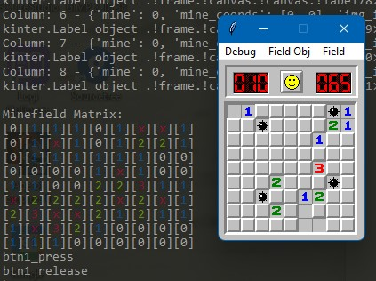

# Minesweeper

  

## :book: About
A replication port of the original Windows XP Minesweeper game winmine.exe.
 
 

	<a href="https://github.com/Tomm-Smith/Morris/issues/new?labels=bug&template=bug-report---.md">Report Bug</a>
	<a href="https://github.com/Tomm-Smith/Morris/issues/new?labels=enhancement&template=feature-request---.md">Request Feature</a>

(<a href="#readme-top">back to top</a>)

<!--## :triangular_ruler: Plans

(<a href="#readme-top">back to top</a>)

-->

## :memo: License
Minesweeper is a registered trademark of Microsoft Corporation with all rights reserved.
All other creative works reside under GNU GPL v3.
See [LICENSE](/LICENSE) [LICENSE DISCLAIMER](https://github.com/Tomm-Smith/Minesweeper/blob/master/LICENSE%20DISCLAIMER) for more information.

(<a href="#readme-top">back to top</a>)

## :beer: Author
Tom Smith - Thomas.Briggs.Smith@gmail.com

Project Link: [https://github.com/Tomm-Smith/Minesweeper](https://github.com/Tomm-Smith/Minesweeper)

(<a href="#readme-top">back to top</a>)
